# Stereo camera calibration extension

2018년도에 Stereo camera calibration의 생산 라인 카메라 셋업을 담당하게 되어,  
Stereo camera calibration의 성능 보장을 위해 opencv 기반의 검사 툴을 만들었고, 다양한 검증을 진행하였다.  
목적은 영상, 좌표점 등을 입력으로 하여, 두개의 카메라 켈리브레이션 알고리즘의 성능이 비슷한지를 비교하여보았다.(OpenCV vs 타사)  
2021년도 Distortion Rational, Thin Prime Model interface를 추가업데이트 하였고, 
2022년도 Fisheye model interface도 업데이트 하였다. 
보통의 경우, 일반 켈리브레이션으로 충분히 커버가 되지만,  
일반 광각이나 좀더 정밀도를 원하는 경우, Rational model을 사용하면 되며,  
초광각 카메라일 경우 Fisheye model을 사용하길 추천드린다.  
각 모델별로 왜곡지수 계산법이 다르기 때문에 반드시 구분해서 사용해 주어야한다. 
	
In 2018, I was responsible for the production line camera setup of stereo camera calibration,  
and to ensure the performance of stereo camera calibration, an opencv-based inspection tool was created  
and various verifications were performed.  
The purpose was to compare the performance of the two camera calibration algorithms  
by inputting images and coordinate points as input. (OpenCV vs. other companies)  
In 2021, Distortion Rational, Thin Prime Model interface were additionally updated,  
The 2022 Fisheye model interface was also updated.  
In general, normal calibration is sufficient to cover,  
But if you want a normal wide angle or more precision, you can use the Rational model,  
For ultra-wide-angle cameras, we recommend using the Fisheye model.  
Since the method of calculating the distortion index is different for each model, it must be used separately. 

## Stereo camera calibration의 정의

동일한 차트로 다양한 각도의 영상을 촬영하여, 두 카메라의 특성의 내부 파라메터와 외부 파라메터를 계산하기 위한 과정을 말하며, 최적의 파라메터를 추출하는 과정을 말한다.
>**Intrinsic parameter(내부파라메터)**   
Focal length(초점거리),  
Principal point(이미지중심),   
Distortion(K1, K2, P1, P2, K3 -왜곡지수) - 일반켈리브레이션에 적합,    
Distortion_Ext(K1, K2, P1, P2, K3, K4, K5, K6-왜곡지수) 광각이나 일반켈이브레이션보다 정밀도를 원하는 경우  
Distortion_Fisheye(K1, K2, K3, K4 -왜곡지수) -초광각의 경우에 사용  
>
>**Extrinsic parameter(외부파라메터)**   
Translation, Rotation - 두 카메라간의 위치, 각도 관계

## 지원기능
이 툴은 간단하게 아래와 같은 기능을 가지고 있다.
1. 원형 그리드 마커 / 사각 그리드 마커 사진 입력 지원 ( M x N 확장 가능 )
2. 마커 대체 좌표 입력 지원 (M x N 확장 가능) - **타사 calibration algorithm 성능 비교 검증 가능**
3. 학습된 켈 결과 데이터를 입력으로  re-calibration 추가 최적화  지원( 사진/ 좌표 입력 지원)
4. 학습된 켈 결과와 입력 데이터 간의 성능검증  **stereo re-projection error 계산** 지원(Stereo RMS)
5. 차트로 부터 Stereo camera를 이용한 **rectify, depth** 계산 지원(사진/ 좌표 입력 지원)
6. 켈데이터 취합 및 초점거리, 이미지중심, 두카메라간의 RT 간의 **산포도 그래프** 지원 

## 확장기능

1. 모든 하위폴더 Stereo camera calibration 지원(사진/좌표 입력) 
	- **빠른 대응 - 3000대 샘플 생산 데이터 검증 및 켈 옵션 변경에 따른 정밀도 차이 검증**
2. 모든 하위폴더 Stereo camera re-calibration 지원(추가 사진/좌표 입력)
3. 모든 하위폴더 Stereo RMS 계산 지원(사진/좌표 입력) 
	- **생산에서 생산된 데이터를 입력으로 검증 가능**
4. \+ focal length와 \- focal length 둘다 변환 지원 ( Default : minus focal length)
5. 외부파라메터 두 카메라간의 RT정보 변환 지원 Left->Right/Right->Left (Default: Right->Left)

	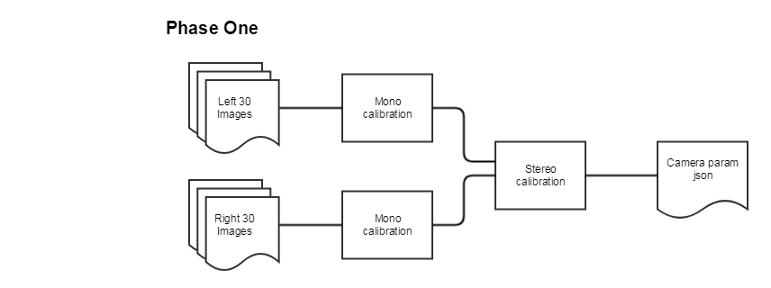  </img>

 - > **Phase One** - Basic stereo camera calibration flow

	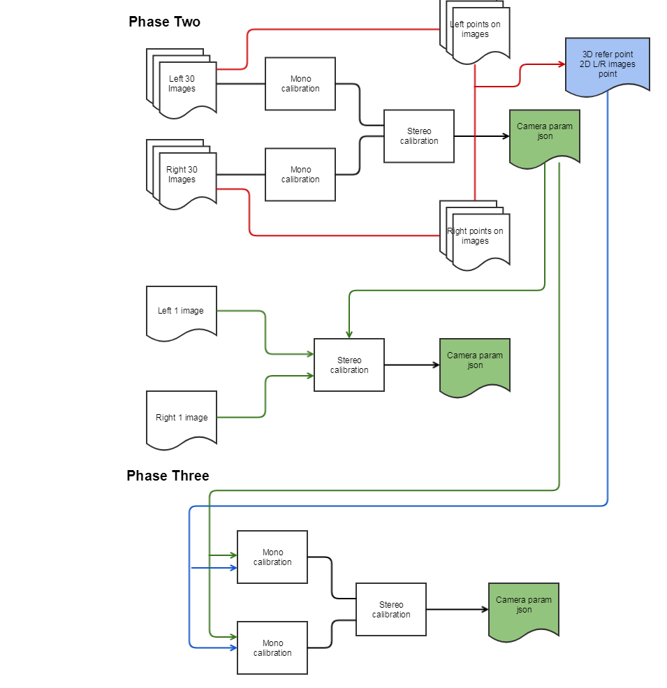  </img> 
 
 - > **Phase Two** - Stereo camera re-calibration flow using image and point

 - > **Phase Three** - Verify calibration parameter and image among different calibration algorithms 

## extract_camera_param.py ( 켈데이터 모음 및 산포도 그래프 지원 )
Stereo camera calibration 데이터의 산포 or 분포를 확인할 때 사용한다  
(각 파라메터의 평균(AVG), 표준편차(STD)는 수동으로 계산필요. 추후 업데이트)
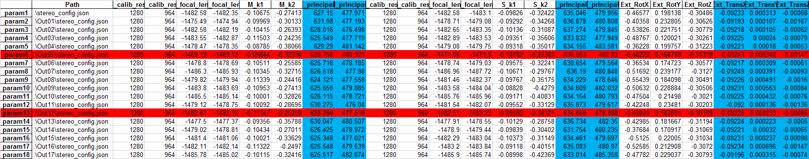  </img>
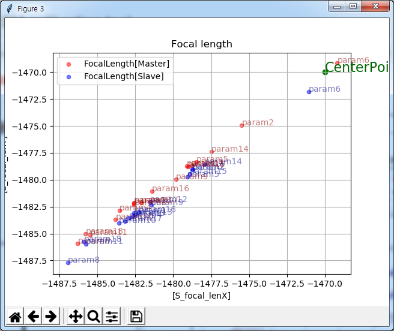</img>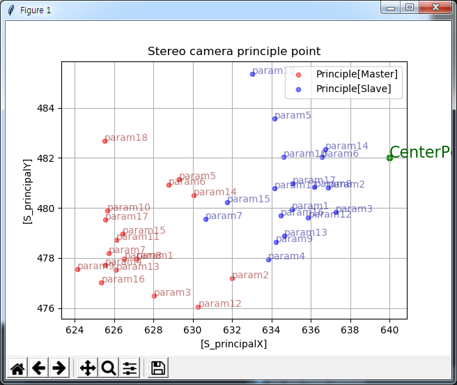</img>
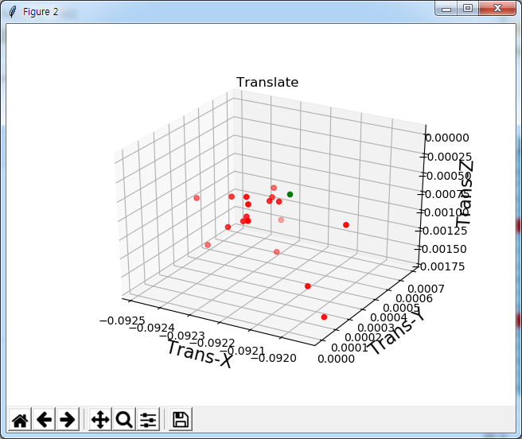  </img>

### multi_calib_cmd.py (확장 실행 파일)
|Option   |  Description   | Remark    |
| -- |--| --|
| - - action |1:calibration수행 2.re-calibration 3.calculate stereo-rms| 학습 재학습 검증  |
| - -path_img  |영상 경로 지정| 하위폴더로 /LEFT, /RIGHT 안에 영상 필요|
| - -path_point  | 좌표 경로 지정| 좌표는 csv형식으로, 차트의 3d points,  왼쪽 영상 2d points,  오른쪽 영상 2d points (총7가지 데이터로 구성 필요)|
| - -path_json  |켈데이터 경로 지정| json형태의 calib data |
| - -recursive  |하위폴더 모두 탐색 및 실행 | --|
| - -  |--| --|
|   |   |   |

### 예제 
	단일 명령어
	 --action 1 --path_img   ./image  
	 --action 1 --path_point ./point  
	 --action 2 --path_img   ./image --path_json ./calib.json  
	 --action 2 --path_point ./point --path_json ./calib.json  
	 --action 3 --path_img   ./image --path_json ./calib.json  
	 --action 3 --path_point ./point --path_json ./calib.json  
  
	확장 재귀 명령어1 --recursive + check point  
	 --action 1 --path_point ./point --recursive  
	 --action 2 --path_point ./point --path_json ./calib.json --recursive  
	 --action 3 --path_point ./point --path_json ./calib.json --recursive  

	확장 재귀 명령어2 --recursive + check image & json(calib data)탐색 
	 --action 2 --path_img   ./image --recursive  
	 --action 3 --path_img   ./image --recursive  

	확장 재귀 명령어3 --recursive + check point & json(calib data)탐색  
	 --action 2 --path_point ./point --recursive  
	 --action 3 --path_point ./point --recursive

### camera_calibrate_input_rms.py(기본 실행 파일)
코드상에 값을 변경해야함 
|  flag | Description     | Remark      |
| -- | -- | --|
| enable_debug_detect_pattern_from_image  |영상에 찾은 좌표점 그리기| true: 1, false: 0|
| enable_debug_display_image_point_and_reproject_point   |영상의 좌표와 켈데이터를 이용한 re-projection좌표 표시  with white space or image| true(from img): 1, false: 0,  true(from white background): 2|
| enable_debug_pose_estimation_display |차트의 위치 X,Y,Z 3축 그리기| false: 0, all_enable: 1, left:2, right:3 |
| enable_debug_loop_moving_of_rot_and_trans |두카메라간의 extrinsic param관계 그림| false: 0, left: 1, right:2  |
| enable_debug_dispatiry_estimation_display |disparity distance검증을 위한 flag - 추가 distance파일 생성| true: 1, false: 0, debug: 2 |
| select_png_or_raw       |영상압축포멧 유무 설정| png,jpg,bmp: 0,  raw: 1  |
| select_point_or_arrow_based_on_reproject_point |영상의 좌표와 켈데이터를 이용한 re-projection좌표와의 연결표시  arrow (scale * 20) | point: 0, arrow: 1 |
| enable_intrinsic_plus_focal |초첨거리  양수,음수 세팅가능| plus: 1,   minus: 0|
| enable_extrinsic_left_to_right |두카메라간의 관계RT 변경가능 (L->R) or (R->L)| left to right: 1,   right to left: 0|
| select_detect_pattern   |차트 모양 선택| circle: 0, square: 1  |
| marker_point_x |pattern's width point| -- |
| marker_point_y |pattern's height point| -- |
| marker_length |pattern's gap | (unit is mm) |
| image_width |이미지크기x| -- |
| image_height |이미지크기y| -- |
| default_camera_param_f |초점거리| -- |
| default_camera_param_cx |이미지중심x| -- |
| default_camera_param_cy |이미지중심y| -- |
|   |   |   |
| default_camera_param_k1 |방사왜곡k1| Normal |
| default_camera_param_k2 |방사왜곡k2| Normal |
| default_camera_param_k3 |접선왜곡p1| Normal |
| default_camera_param_k4 |접선왜곡p2| Normal |
| default_camera_param_k5 |방사왜곡k3| Normal |
|   |   |   |
| default_camera_param_k1 |방사왜곡k1| Ext지원 |
| default_camera_param_k2 |방사왜곡k2| Ext지원 |
| default_camera_param_p1 |접선왜곡p1| Ext지원 |
| default_camera_param_p2 |접선왜곡p2| Ext지원 |
| default_camera_param_k3 |방사왜곡k3| Ext지원 |
| default_camera_param_k4 |방사왜곡k4| Ext지원 |
| default_camera_param_k5 |방사왜곡k5| Ext지원 |
| default_camera_param_k6 |방사왜곡k6| Ext지원 |
|   |   |   |
| default_camera_param_k1 |방사왜곡k1| Fisheye지원 |
| default_camera_param_k2 |방사왜곡k2| Fisheye지원 |
| default_camera_param_k5 |방사왜곡k3| Fisheye지원 |
| default_camera_param_k6 |방사왜곡k4| Fisheye지원 |
|   |   |   |

## Input format
1. 사진 - 하위폴더로 /LEFT, /RIGHT 안에 영상 필요
2. 좌표 - *.csv로 저장
단위 - meter(Chart 3D) , pixel(Image 2D)  
	
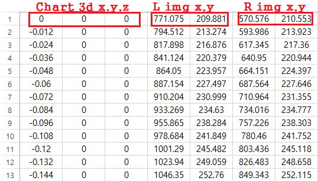
 
3. 켈데이터 - 아래 output format of calibration data와 상동

## Output format of calibration data 
	Normal calibration parameter format
	{
	    "type": "Calibration Parameter for Stereo Camera",
	    "version": 1.5,
	    "master": {
	        "lens_params": {
	            "focal_len": [-1451.90081, -1451.90081],
	            "principal_point": [633.86647, 490.15746],
	            "skew": 0,
	            "k1": -0.09071,
	            "k2": -0.35418,
	            "k3": -0.0,
	            "k4": -0.0,
	            "k5": 0.0,
	            "calib_res": [1280, 964]
	        }
	    },
	    "slave": {
	        "camera_pose": {
	            "trans": [-0.08992,-0.00435,-0.00783],
	            "rot": [-0.72489,-0.74453,0.05402]
	        },
	        "lens_params": {
	            "focal_len": [-1476.51816, -1476.51816],
	            "principal_point": [644.09618,475.50106],
	            "skew": 0,
	            "k1": -0.06254,
	            "k2": -0.46658,
	            "k3": -0.0,
	            "k4": -0.0,
	            "k5": 0.0,
	            "calib_res": [1280,964]
	        }
	    },
	    "reprojection_error": 0.24715,
	    "essensial_matrix": [
	        -4.919e-05,
	        -0.00666183,
	        -0.00426881,
	        0.0078855,
	        -0.00113155,
	        0.08992533,
	        0.00425427,
	        -0.09001622,
	        -0.00119326
	    ],
	    "fundamental_matrix": [
	        -1e-07,
	        -1.315e-05,
	        -0.00572848,
	        1.557e-05,
	        -2.23e-06,
	        0.24901059,
	        0.00506165,
	        -0.25288582,
	        1.0
	    ]
	}

	Extend calibration parameter format (Rational model)
	{
		"type": "Ext Calibration Parameter for Stereo Camera",
		"version": 2.0,
		"master": {
			"serial": 0,
			"lens_params": {
				"focal_len": [
					-1475.8438558840255,
					-1475.9144124848399
				],
				"principal_point": [
					643.1504409323326,
					476.1576407436287
				],
				"skew": 0,
				"k1": 4.341599828468875,
				"k2": 6.096425698769582,
				"p1": -0.0,
				"p2": -0.0,
				"k3": -32.7042821466911,
				"k4": 4.333102690614714,
				"k5": 8.062706520760589,
				"k6": -34.974918382234364,
				"calib_res": [
					1280,
					964
				]
			}
		},
		"slave": {
			"serial": 1,
			"camera_pose": {
				"trans": [
					-0.09198627034851362,
					9.149339085975849e-05,
					0.0005000104834382075
				],
				"rot": [
					0.3056633704056768,
					0.02728558124323125,
					-0.20100115955262224
				]
			},
			"lens_params": {
				"focal_len": [
					-1471.899028531768,
					-1472.0624335869813
				],
				"principal_point": [
					642.7938073271308,
					484.61951282333365
				],
				"skew": 0,
				"k1": 9.673801188385836,
				"k2": 16.44737876619034,
				"p1": -0.0,
				"p2": -0.0,
				"k3": -25.733151908025732,
				"k4": 9.658026469728467,
				"k5": 18.74934483218456,
				"k6": -23.909701335433937,
				"calib_res": [
					1280,
					964
				]
			}
		},
		"reprojection_error": 0.09428097,
	}
	Fisheye calibration parameter format
	{
		"type": "Fisheye Calibration Parameter for Stereo Camera",
		"version": 3.0,
		"master": {
			"serial": 0,
			"lens_params": {
				"focal_len": [
					-1475.6414333240527,
					-1475.7139330022308
				],
				"principal_point": [
					643.1761988737513,
					475.9617388115814
				],
				"skew": 0,
				"k1": [ 0.34080396691201387 ],
				"k2": [-1.853808686819986   ],
				"k3": [ 7.774675919955728   ],
				"k4": [-14.945278220622367  ],
				"calib_res": [
					1280,
					964
				]
			}
		},
		"slave": {
			"serial": 1,
			"camera_pose": {
				"trans": [
					-0.09205850407926121,
					-0.0001261269697385896,
					0.0003901162518838381
				],
				"rot": [
					0.28688937593642166,
					0.02460384934886728,
					-0.20374292775635208
				]
			},
			"lens_params": {
				"focal_len": [
					-1471.993108627942,
					-1472.162649858913
				],
				"principal_point": [
					643.0553068709562,
					484.4288262917564
				],
				"skew": 0,
				"k1": [  0.33924681825230457 ],
				"k2": [ -1.8096814377959507 ],
				"k3": [  7.8206607535759955 ],
				"k4": [ -15.27301764416608  ],
				"calib_res": [
					1280,
					964
				]
			}
		},
		"reprojection_error": 0.09303644
	}

## Image point vs Reprojected point based on calibration data
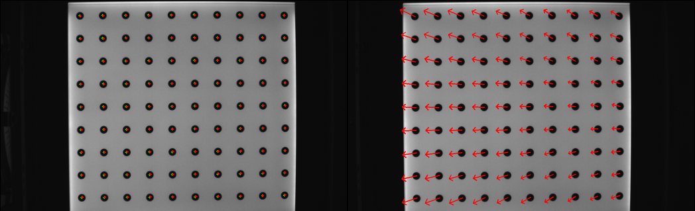 </img>
+ green color + -> image point	
+ red color + -> reprojected point
+ arrow start -> image point
+ arrow end -> reprojected point
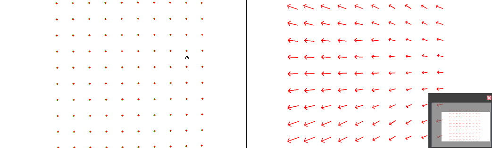 </img>
+ display on white space instead of image

## Normal/Ext/Fisheye지원 Distortion extend parameter적용방법
-	camera_calibrate_input_rms - 기존 k1,k2,p1,p2,k3지원 코드
-	camera_calibrate_input_rms_ext - k1,k2,p1,p2,k3,k4,k5,k6 지원코드 (추가확장가능)
-	camera_calibrate_input_rms_fisheye - k1,k2,k3,k4 지원 코드
### multi_calib_cmd.py에서 아래와 같이 15,16,17 line을 수정해주면 됨
- Normal설정
	- import camera_calibrate_input_rms as stereoCalib
	- #import camera_calibrate_input_rms_ext as stereoCalib
	- #import camera_calibrate_input_rms_fisheye as stereoCalib
- Ext설정
	- #import camera_calibrate_input_rms as stereoCalib
	- import camera_calibrate_input_rms_ext as stereoCalib
	- #import camera_calibrate_input_rms_fisheye as stereoCalib
- Fisheye설정
	- #import camera_calibrate_input_rms as stereoCalib
	- #import camera_calibrate_input_rms_ext as stereoCalib
	- import camera_calibrate_input_rms_fisheye as stereoCalib

## 테스트 검증 
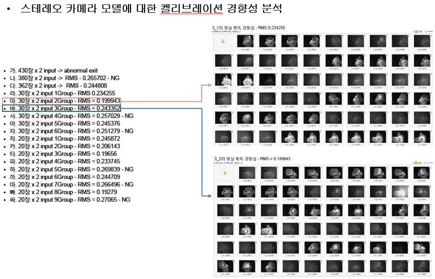 </img>
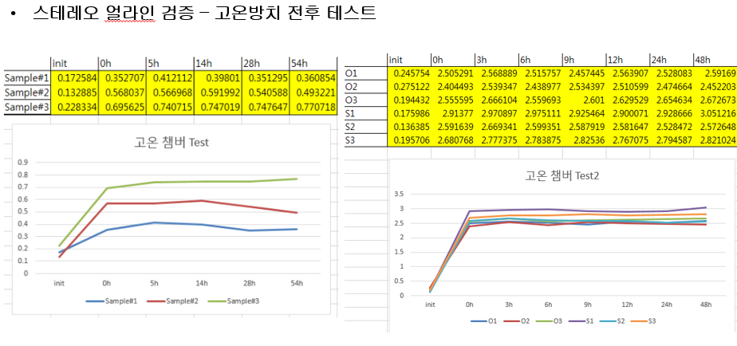 </img>

## 참고문헌
1. [https://github.com/bvnayak/stereo_calibration](https://github.com/bvnayak/stereo_calibration)
2. https://sourishghosh.com/2016/stereo-calibration-cpp-opencv/
3. https://opencv-python-tutroals.readthedocs.io/en/latest/py_tutorials/py_calib3d/py_calibration/py_calibration.html#calibration
4. https://docs.opencv.org/3.4/db/d58/group__calib3d__fisheye.html
5. https://docs.opencv.org/3.4/d9/d0c/group__calib3d.html
6. http://www.vision.caltech.edu/bouguetj/calib_doc/ 
7. https://stackoverflow.com/questions/50603978/fisheye-lens-stereo-calibration-opencv-python
8. https://stackoverflow.com/questions/50857278/raspicam-fisheye-calibration-with-opencv

## 그밖의 사진(정리중...)
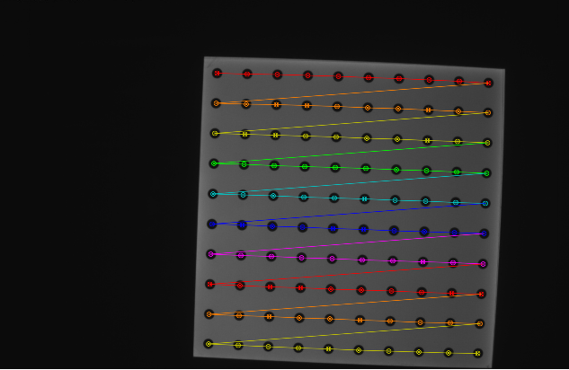 </img>
 원형 그리드 차트 점 위치 (디버깅)
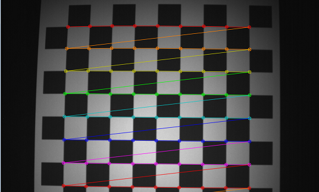 </img>
 사각형 그리드 차트 점 위치 (디버깅)
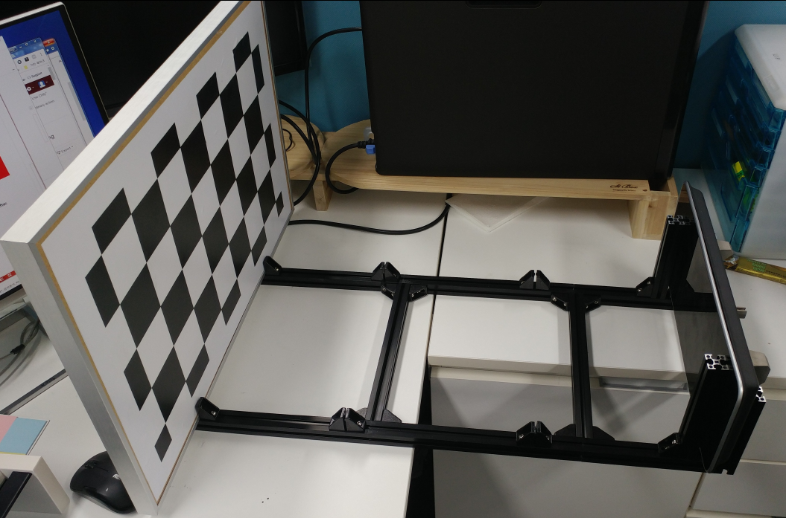 </img>
 차트와 카메라 간의 거리 측정 체크 (디버깅)
 </img>
 차트의 RT관련 축 그리기 (디버깅)
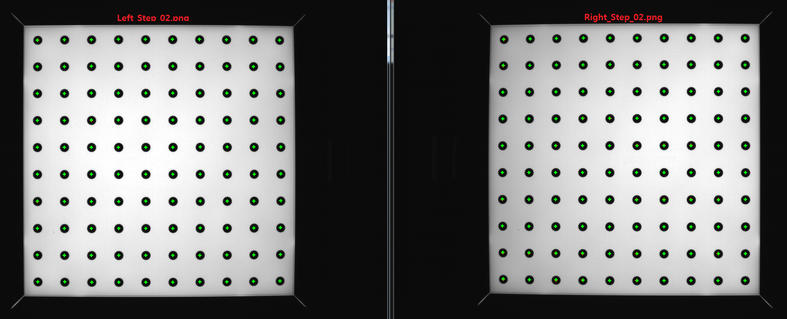 </img>
 이미지상의 차트 교차점과 켈데이터에 의해 계산된 점 그리기( 디버깅)
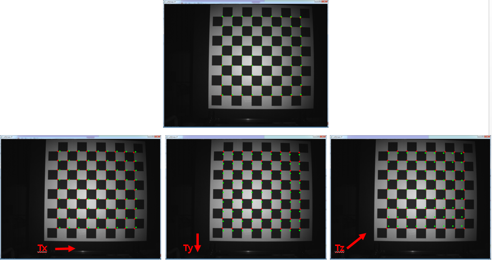 </img>
 두 카메라 간의 RT에 대한 opencv축 검증( 디버깅)
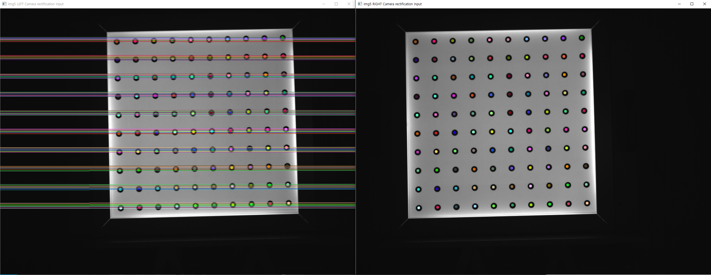 </img>
 스테레오 영상을 이용한 좌표 rectification (디버깅)
