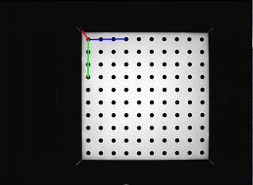

# Stereo camera calibration extension

2018년도에 Stereo camera calibration의 생산 라인 카메라 셋업을 담당하게 되어, Stereo camera calibration의 성능 보장을 위한 다양한 검증을 위해, opencv 기반의 검사 툴을 만들어 사용하였다.

## Stereo camera calibration의 정의

동일한 차트로 다양한 각도의 영상을 촬영하여, 두 카메라의 특성의 내부 파라메터와 외부 파라메터를 계산하기 위한 과정을 말하며, 최적의 파라메터를 추출하는 과정을 말한다.
>**Intrinsic parameter(내부파라메터)** - Focal length(초점거리), Principal point(이미지중심), Distortion(K1, K2, K3, P1, P2-왜곡지수)
>
>**Extrinsic parameter(외부파라메터)** - Translation, Rotation - 두 카메라간의 위치, 각도 관계

## 지원기능
이 툴은 간단하게 아래와 같은 기능을 가지고 있다.
1. 원형 그리드 마커 / 사각 그리드 마커 사진 입력 지원 ( M x N 확장 가능 )
2. 마커 대체 좌표 입력 지원 (M x N 확장 가능) - **타사 calibration algorithm 성능 비교 검증 가능**
3. 학습된 켈 결과 데이터를 입력으로  re-calibration 추가 최적화  지원( 사진/ 좌표 입력 지원)
4. 학습된 켈 결과와 입력 데이터 간의 성능검증  **stereo re-projection error 계산** 지원(Stereo RMS)
5. 차트로 부터 Stereo camera를 이용한 **rectify, depth** 계산 지원(사진/ 좌표 입력 지원)
6. 켈데이터 취합 및 초점거리, 이미지중심, 두카메라간의 RT 간의 **산포도 그래프** 지원 

## 확장기능

1. 모든 하위폴더 Stereo camera calibration 지원(사진/좌표 입력) 
	- **빠른 대응 - 3000대 샘플 생산 데이터 검증 및 켈 옵션 변경에 따른 정밀도 차이 검증**
2. 모든 하위폴더 Stereo camera re-calibration 지원(추가 사진/좌표 입력)
3. 모든 하위폴더 Stereo RMS 계산 지원(사진/좌표 입력) 
	- **생산에서 생산된 데이터를 입력으로 검증 가능**
4. \+ focal length와 \- focal length 둘다 변환 지원 ( Default : minus focal length)
5. 외부파라메터 두 카메라간의 RT정보 변환 지원 Left->Right/Right->Left (Default: Right->Left)

  

 - > **Phase One** - Basic stereo camera calibration flow

   
 
 - > **Phase Two** - Stereo camera re-calibration flow using image and point

 - > **Phase Three** - Verify calibration parameter and image among different calibration algorithms 

## extract_camera_param.py ( 켈데이터 모음 및 산포도 그래프 지원 )
Stereo camera calibration 데이터의 산포 or 분포를 확인할 때 사용한다
  

  

### multi_calib_cmd.py (확장 실행 파일)
|Option   |  Description   | Remark    |
| -- |--| --|
| - - action |1:calibration수행 2.re-calibration 3.calculate stereo-rms| 학습 재학습 검증  |
| - -path_img  |영상 경로 지정| 하위폴더로 /LEFT, /RIGHT 안에 영상 필요|
| - -path_point  | 좌표 경로 지정| 좌표는 csv형식으로, 차트의 3d points,  왼쪽 영상 2d points,  오른쪽 영상 2d points (총7가지 데이터로 구성 필요)|
| - -path_json  |켈데이터 경로 지정| json형태의 calib data |
| - -recursive  |하위폴더 모두 탐색 및 실행 | --|
| - -  |--| --|
|   |   |   |

### 예제 
	단일 명령어
	 --action 1 --path_img   ./image  
	 --action 1 --path_point ./point  
	 --action 2 --path_img   ./image --path_json ./calib.json  
	 --action 2 --path_point ./point --path_json ./calib.json  
	 --action 3 --path_img   ./image --path_json ./calib.json  
	 --action 3 --path_point ./point --path_json ./calib.json  
  
	확장 재귀 명령어1 --recursive + check point  
	 --action 1 --path_point ./point --recursive  
	 --action 2 --path_point ./point --path_json ./calib.json --recursive  
	 --action 3 --path_point ./point --path_json ./calib.json --recursive  

	확장 재귀 명령어2 --recursive + check image & json(calib data)탐색 
	 --action 2 --path_img   ./image --recursive  
	 --action 3 --path_img   ./image --recursive  

	확장 재귀 명령어3 --recursive + check point & json(calib data)탐색  
	 --action 2 --path_point ./point --recursive  
	 --action 3 --path_point ./point --recursive

### camera_calibrate_input_rms.py(기본 실행 파일)
코드상에 값을 변경해야함 
|  flag | Description     | Remark      |
| -- | -- | --|
| enable_debug_detect_pattern_from_image  |영상에 찾은 좌표점 그리기| true: 1, false: 0|
| enable_debug_display_image_point_and_reproject_point   |영상의 좌표와 켈데이터를 이용한 re-projection좌표 표시| true: 1, false: 0|
| enable_debug_pose_estimation_display |차트의 위치 X,Y,Z 3축 그리기| false: 0, all_enable: 1, left:2, right:3 |
| enable_debug_loop_moving_of_rot_and_trans |두카메라간의 extrinsic param관계 그림| false: 0, left: 1, right:2  |
| enable_debug_dispatiry_estimation_display |disparity distance검증을 위한 flag - 추가 distance파일 생성| true: 1, false: 0, debug: 2 |
| select_png_or_raw       |영상압축포멧 유무 설정| png,jpg,bmp: 0,  raw: 1  |
| select_point_or_arrow_based_on_reproject_point |영상의 좌표와 켈데이터를 이용한 re-projection좌표와의 연결표시 | point: 0, arrow: 1 |
| enable_intrinsic_plus_focal |초첨거리  양수,음수 세팅가능| plus: 1,   minus: 0|
| enable_extrinsic_left_to_right |두카메라간의 관계RT 변경가능 (L->R) or (R->L)| left to right: 1,   right to left: 0|
| select_detect_pattern   |차트 모양 선택| circle: 0, square: 1  |
| marker_point_x |pattern's width point| -- |
| marker_point_y |pattern's height point| -- |
| marker_length |pattern's gap | (unit is mm) |
| image_width |이미지크기x| -- |
| image_height |이미지크기y| -- |
| default_camera_param_f |초점거리| -- |
| default_camera_param_cx |이미지중심x| -- |
| default_camera_param_cy |이미지중심y| -- |
| default_camera_param_k1 |방사왜곡k1| -- |
| default_camera_param_k2 |방사왜곡k2| -- |
| default_camera_param_k3 |접선왜곡p1| -- |
| default_camera_param_k4 |접선왜곡p2| -- |
| default_camera_param_k5 |방사왜곡k3| -- |
|   |   |   |

## Output format of calibration data 
	{
	    "type": "Calibration Parameter for Stereo Camera",
	    "version": 1.5,
	    "master": {
	        "lens_params": {
	            "focal_len": [-1451.90081, -1451.90081],
	            "principal_point": [633.86647, 490.15746],
	            "skew": 0,
	            "k1": -0.09071,
	            "k2": -0.35418,
	            "k3": -0.0,
	            "k4": -0.0,
	            "k5": 0.0,
	            "calib_res": [1280, 964]
	        }
	    },
	    "slave": {
	        "camera_pose": {
	            "trans": [-0.08992,-0.00435,-0.00783],
	            "rot": [-0.72489,-0.74453,0.05402]
	        },
	        "lens_params": {
	            "focal_len": [-1476.51816, -1476.51816],
	            "principal_point": [644.09618,475.50106],
	            "skew": 0,
	            "k1": -0.06254,
	            "k2": -0.46658,
	            "k3": -0.0,
	            "k4": -0.0,
	            "k5": 0.0,
	            "calib_res": [1280,964]
	        }
	    },
	    "reprojection_error": 0.24715,
	    "essensial_matrix": [
	        -4.919e-05,
	        -0.00666183,
	        -0.00426881,
	        0.0078855,
	        -0.00113155,
	        0.08992533,
	        0.00425427,
	        -0.09001622,
	        -0.00119326
	    ],
	    "fundamental_matrix": [
	        -1e-07,
	        -1.315e-05,
	        -0.00572848,
	        1.557e-05,
	        -2.23e-06,
	        0.24901059,
	        0.00506165,
	        -0.25288582,
	        1.0
	    ]
	}

## 테스트 검증 

## 참고문헌
1. [https://github.com/bvnayak/stereo_calibration](https://github.com/bvnayak/stereo_calibration)
2. https://sourishghosh.com/2016/stereo-calibration-cpp-opencv/
3. https://opencv-python-tutroals.readthedocs.io/en/latest/py_tutorials/py_calib3d/py_calibration/py_calibration.html#calibration
 

## 그밖의 사진(정리중...)

 원형 그리드 차트 점 위치 (디버깅)

 사각형 그리드 차트 점 위치 (디버깅)

 차트와 카메라 간의 거리 측정 체크 (디버깅)

 차트의 RT관련 축 그리기 (디버깅)

 이미지상의 차트 교차점과 켈데이터에 의해 계산된 점 그리기( 디버깅)

 두 카메라 간의 RT에 대한 opencv축 검증( 디버깅)

 스테레오 영상을 이용한 좌표 rectification (디버깅)
