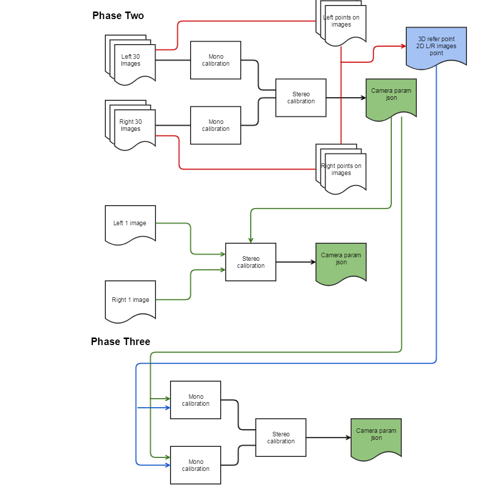
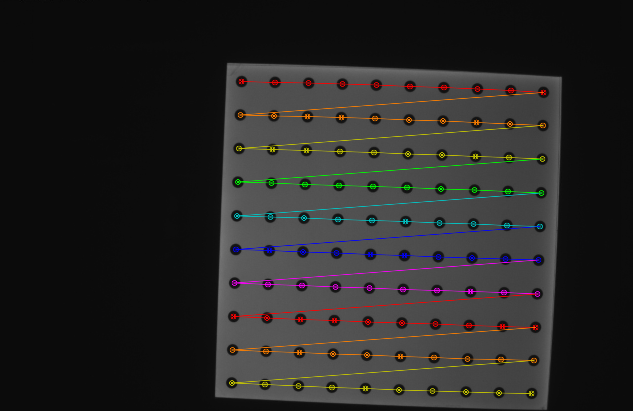

# stereo_camera_calibration

Stereo camera calibration

this section is doing stereo camera calibration extention using opencv python. 
나는 stereo camera calibration과 관련하여, 일반적인것 부터 확장성을 가지도록 설계 및 프로그램 하였다. 
그리하여 이미지 패턴을 이용하여 카메라 켈리브레이션을 하는 것을 포함하여, 실제 켈리브레이션 된 데이터가 맞는지를 계산하여 검증해보았다.
또한 다른 이미지 패턴으로 켈리브레이션 된 영상 및 좌표도 비교가 가능하여, 유효한 켈데이터인지를 검증해볼 수 있다.
또한 계산된 켈데이터를 추가적으로 취득한 영상이나 점좌표로 더 피팅하여 그 상황에 맞는 값을 추론해 볼 수 있다.
디버깅용으로 영상안에 인식된 마커점을 볼수 있거나 머커의 특정점(0,0,0)의 position을 계산한다거나 실제 점과 켈데이터에 따른 reprojection point점간의 상관관계도 출력해 볼 수 있다.
켈레브레이션 파라메터의 focal length를 + 혹은 -로 변환해 볼수 있으며, left<->right간의 Extrinsic R,T를 변경해서 검토가능하도록 프로그래밍해 놓았다.
그리고 마지막으로 두 점사이의 거리를 구할 수 있도록 해놓았다. 

this tool have some functions below about stereo camera

이 사진은 여러장의 스테레오사진을 취득하여, 스테레오 카메라 켈리브레이션을 진행하는 다이어그램이다

이 프로그램은 더 확장하여, 나온 켈데이터와 영상의 좌표를 저장하고, 이를 입력으로 하여 다시 결과를 도출할수 있도록 설계하였다. 
이로 인해, 패턴의 모양 차이와 관계없이 좌표만을 가지고 켈리브레이션 수행할 수 있어, 켈리브레이션 알고리즘간의 비교가 가능하였다 (opencv vs matlab) 

 1. **stereo camera calibration using stereo images**
    - **support circle grid marker**
    - **support square grid marker**
2. **stereo camera calibration using stereo points**
    - **support marker's point calibration** 
    - **(can be compare performance between calibration algorithms)**
3. **optimize calibration using camera-calibration data and additional images**
4. **optimize calibration using camera-calibration data and additional points**
5. **can calculate reprojection error for stereo** 
    - **it is sightly bigger than values of reprojection error**
6.  **display detected point  of target for debugging**
7.  **display pose estimation for debugging about marker chart**
8.  **display detection point on image and reprojection point from marker using calibration data**
9. **can transform from plus to minus or revert about focal length**
10. **can transform from left to right image or revert about RT**

Please follow below - made by  [magicst3@gmail.com](mailto:magicst3@gmail.com)  
this tool is support stereo calibration using both image or camera param. if you want to use images, please make folder and make subfolder name about LEFT and RIGHT. and copy left,right image to each folder go to #1 if you want to use camear data, please set up json(camera intrinsic, extrinsic param) and path of points(pattern 3d coordinate and L/R image coordinate)

go to #2 if you want to test images based on designed camear data, please make folder and make subfolder name about LEFT and RIGHT. and copy left,right image to each folder

go to #3

#1 camera_calibrate_input_rms.py [path_of_image] ex1) camera_calibrate_input_rms.py ./image33/

#2 camera_calibrate_input_rms.py [path_of_image] [json file] [path of csv] ex2) camera_calibrate_input_rms.py ./input_sm/ ./input_sm/stereo_config2.json ./input_sm/

ex3) camera_calibrate_input_rms.py ./input_lgit/ ./input_lgit/stereo_config_33_2_1.json ./input_lgit/ #3 camera_calibrate_input_rms.py [path_of_image] [json file] ex2) camera_calibrate_input_rms.py ./image33/ ./input_sm/stereo_config2.json

================================================================================

#example #D:\HET\calib\data\example\image\cal\circle\raw #change option

select_png_or_raw = 1 #png: 0, raw: 1 #D:\HET\calib\data\example\image\cal\circle\png #change option # select_png_or_raw = 0 #png: 0, raw: 1 #D:\HET\calib\data\example\image\cal\square\png_8_5 # marker_point_x = 8 #pattern's width point # marker_point_y = 5 #pattern's height point # marker_length = 60 #pattern's gap (unit is mm)

(https://github.com/yeolip/stereo_camera_calibration/tree/readme_edit#select_detect_pattern----1--------------------------------circle-0-square-1)select_detect_pattern = 1 #circle: 0, square: 1

(https://github.com/yeolip/stereo_camera_calibration/tree/readme_edit#select_png_or_raw--------0--------------------------------png-0-raw-1-1)select_png_or_raw = 0 #png: 0, raw: 1

#D:\HET\calib\data\example\image\cal\square\raw_6_4

(https://github.com/yeolip/stereo_camera_calibration/tree/readme_edit#marker_point_x--6-----patterns-width-point)marker_point_x = 6 #pattern's width point

(https://github.com/yeolip/stereo_camera_calibration/tree/readme_edit#marker_point_y--4-----patterns-height-point)marker_point_y = 4 #pattern's height point

(https://github.com/yeolip/stereo_camera_calibration/tree/readme_edit#marker_length--60------patterns-gap-unit-is-mm-1)marker_length = 60 #pattern's gap (unit is mm)

(https://github.com/yeolip/stereo_camera_calibration/tree/readme_edit#select_detect_pattern----1--------------------------------circle-0-square-1-1)select_detect_pattern = 1 #circle: 0, square: 1

(https://github.com/yeolip/stereo_camera_calibration/tree/readme_edit#select_png_or_raw--------1--------------------------------png-0-raw-1-1)select_png_or_raw = 1 #png: 0, raw: 1

#D:\HET\calib\data\example\image\cal\circle\raw D:\HET\calib\data\example\image\cal\circle\raw\stereo_config_result_r_to_l.json

(https://github.com/yeolip/stereo_camera_calibration/tree/readme_edit#select_png_or_raw--------1--------------------------------png-0-raw-1-2)select_png_or_raw = 1 #png: 0, raw: 1

# reference

[https://github.com/bvnayak/stereo_calibration](https://github.com/bvnayak/stereo_calibration)

